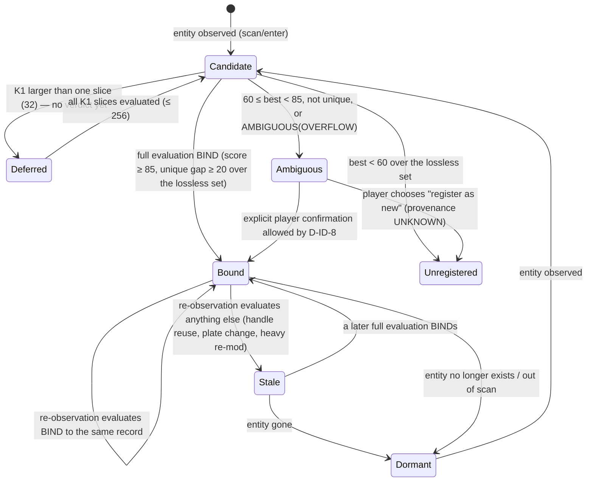
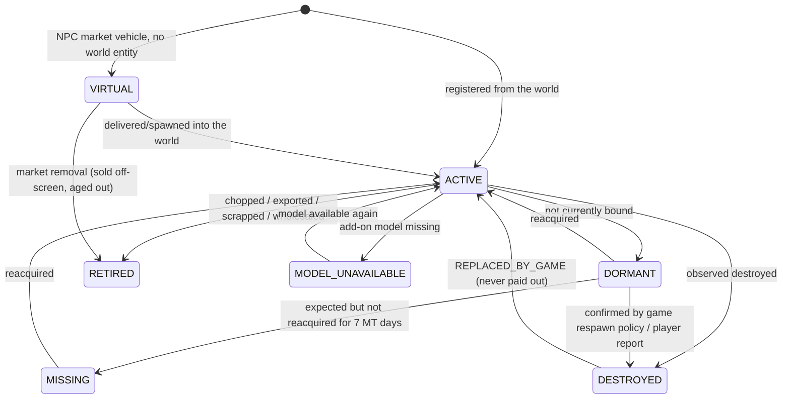

# LSAX — Domain Model, Ownership/Provenance, Vehicle Identity

Document: LSAX-DOMAIN-MODEL.md · Spec: LSAX MASTER SPEC v1.0 DRAFT2 · Status: DRAFT for independent re-audit

## 1. Principles

1. LSAX simulates a **specific vehicle**, not a GTA model.
2. The GTA entity handle is a **runtime reference only** (invariant 1).
3. Decorators are **hints** (invariant 2).
4. Identity = LSAX VehicleId + multifactor fingerprint + confidence + collision handling (invariant 3).
5. **Ambiguous → never auto-merge** (invariant 4). Refusal is always a valid outcome.
6. Ownership (who holds rights), provenance/title (legal standing), market state (listed?), and physical
   lifecycle (does it exist?) are **four orthogonal state dimensions**.
7. Domain types have no dependency on SHVDN, LemonUI, Scaleform or SQLite (Core purity, invariant 5); GTA
   access goes through ports (`IWorldPort`, `IWalletPort`, `IClockPort`, …) implemented in an adapter layer.

## 2. Aggregate and entity overview

```mermaid
classDiagram
  class Campaign { CampaignId; seed; createdWall }
  class Timeline { TimelineId; parentTxn; forkP; reason }
  class Vehicle { VehicleId; lsaxVin; modelHash; modelName; birthMt; lifecycle }
  class Registration { plate; plateStyle; issuedBy; mt }
  class Ownership { owner: Party; since: TxnId; acquisition }
  class Title { status; flags; since }
  class Fingerprint { model; plate; colours; mods; extras; livery; tint; wheelType }
  class OdometerCheckpoint { vehicleId; metres; mt; p }
  class ConditionState { mech[0..1000]; body[0..1000]; components }
  class ModSnapshot { kind: Baseline|Current; slots; mt }
  class HistoryEvent { kind; severity; mt; odoM; txnId? }
  class Listing { ListingId; market: Legal|Underground; ask; state }
  class Offer { OfferId; listingId; party; amount; version; state }
  class Transaction { TxnId; idemKey; kind; state }
  class Party { PartyId; kind: Protagonist|Npc|Dealer|Fence|Exporter|ChopShop|Collector }
  class HeatState { scope: Vehicle|Protagonist; value; mt }
  class MailItem { MailId; kind; params; mt }
  Campaign "1" --> "*" Timeline
  Vehicle "1" --> "0..1" Registration
  Vehicle "1" --> "1" Ownership
  Vehicle "1" --> "1" Title
  Vehicle "1" --> "*" HistoryEvent
  Vehicle "1" --> "*" OdometerCheckpoint
  Vehicle "1" --> "2" ModSnapshot
  Vehicle "1" --> "0..*" Listing
  Listing "1" --> "*" Offer
  Transaction "1" --> "*" HistoryEvent
```



All state except Campaign/Timeline/journal/config/catalogue/logs is **timeline-coupled**
(LSAX-SAVELOAD-FEASIBILITY.md §4.4): it is a projection of the active timeline path.

## 3. Parties and wallets

- **Protagonist parties:** Michael (`SP0`), Franklin (`SP1`), Trevor (`SP2`). Each has its own GTA wallet
  (`SPx_TOTAL_CASH`, E2-1) and owns vehicles separately. The acting party = current player ped model.
- If the player ped is not one of the three protagonist models, the wallet is **undefined** (`Player.Money`
  returns 0 and ignores writes, E2-1/E2-2): every LSAX money operation is refused with
  `lsax.error.wallet.unsupported_character`. DESIGN DECISION D-ECO-2.
- NPC parties (private sellers/buyers, dealers, fences, exporters, chop shops, collectors, gangs) have LSAX-side
  budgets only (LSAX-MASTER-SPEC §18); they never touch GTA money.

## 4. Vehicle identity

### 4.1 VehicleId and LSAX VIN

- `VehicleId`: 128-bit, generated by LSAX. Player-registered vehicles: random (`RNGCryptoServiceProvider`).
  NPC-generated vehicles: derived injectively from the generation identity `(campaign, market_step_index, segment,
  generation_ordinal)` — low 64 bits `mix64(pack(step, segment, ordinal))`, high 64 bits campaign salt with the
  generated-namespace bit (LSAX-NPC-GENERATION-MODEL.md §2, D-GEN-6), so a rewind regenerates the same market and
  distinct generation events can never share an id. Identity is **never** derived from a handle, plate or decorator.
- `LsaxVin`: 17-character display code computed from VehicleId (base-32 alphabet without I/O/Q, check digit at
  position 9). Cosmetic, shown in the inspector and listings; not an in-game plate.

### 4.2 Runtime binding (DRAFT2: audit P1-01, D-ID-6, D-ID-8)

`Binding = { handle, vehicleId, lastSeenGt, lastPos, occupiedSinceBind }`, memory only, bounded (≤ 256 bindings;
LRU-evict DORMANT first). **A handle, a decorator token and the binding cache are scheduling hints only:** they
decide which entities are re-observed and in which order candidate records are evaluated. They never decide
identity, never skip scoring and never keep a binding on their own.

**Every observation** of a world vehicle (bounded cadence, LSAX-PERFORMANCE-BUDGET.md §2) reads the full fingerprint
(§4.4) and runs the §4.4 decision over the complete, lossless candidate set:

- decision `BIND(v)` and the handle was bound to `v` → stays Bound; changed fields are recorded as `MODIFICATION`
  events and the stored fingerprint is updated (e.g. a respray keeps the score ≥ 85);
- decision `BIND(w)`, `w ≠ v` → rebind to `w`; `v` → Dormant (its last-seen context is kept);
- decision AMBIGUOUS / NO MATCH → the binding is dropped (`v` → Stale, re-verified on its next observation); the
  entity is Ambiguous or Unregistered. **A reused handle therefore can never inherit a VehicleId** — it gets exactly
  what its own multifactor evidence yields.



**Explicit confirmation (D-ID-8):** the player may confirm an Ambiguous entity as record `v` only if exactly one
record scores ≥ 60 for this entity (that record is `v`) **and** either (a) the plate text + style equal `v`'s (only
colour/mod/cosmetic/context differences) or (b) the player occupied this entity continuously since the last BIND of
the same handle to `v` (in-place change at a mod shop: plate change, full re-mod). Otherwise only "register as new"
(provenance UNKNOWN, §5) is offered. Confirmation is an explicit action, never automatic; it records `PLATE_CHANGE`
/ `MODIFICATION` events.

### 4.3 Decorator hint

- One int decorator `lsax_rt` holding a **per-session random 31-bit token** mapped in memory to a VehicleId.
- Use: re-observation priority and the first candidate evaluated. It never skips or shortens the §4.4 decision;
  a stale or colliding token cannot bind a different vehicle (regression H6).
- Never persisted as identity; tokens from a previous session are meaningless (and decorators are not assumed
  to survive recreation, E3-5). Registration requires the 3.7 unlock (E3-3); if it fails the hint is disabled
  (R-ID-3), with no change to identity results. Removal must call `DECOR_REMOVE` directly (SHVDN
  `DecoratorInterface.Remove` bug, E3-2).

### 4.4 Fingerprint, score and lossless bounded candidate search (DRAFT2: audit P1-02, D-ID-7)

All fields come from natives verified to exist (feasibility.md E4-1).

| Field | Source | Weight | Match rule |
|---|---|---:|---|
| Model hash | `GET_ENTITY_MODEL` | gate | must be equal, else score 0 |
| Plate text + style | `GET_VEHICLE_NUMBER_PLATE_TEXT`, `_INDEX` | 40 | exact (trimmed, case-insensitive) = 40; else 0 |
| Colours | `GET_VEHICLE_COLOURS`, `_EXTRA_COLOURS`, custom RGB flags/values | 20 | 5 per equal component (primary, secondary, pearl, wheel) |
| Mods | `GET_VEHICLE_MOD_KIT`, `GET_VEHICLE_MOD` (per slot), `IS_TOGGLE_MOD_ON`, `GET_VEHICLE_WHEEL_TYPE` | 25 | 25 × (equal slots / compared slots) |
| Cosmetic set | `GET_VEHICLE_LIVERY`, `GET_VEHICLE_WINDOW_TINT`, extras on/off | 10 | proportional |
| Context | last-seen location/kind (garage, parked, impound lot), time since last seen | 15 | 15 if within 50 m of last-seen or at a known garage/impound spawn point; 5 if same district; 0 otherwise |

Score = Σ weights (max 110) × 100 / 110, integer (rdiv). Thresholds: **BIND ≥ 85 and unique** (second-best
≤ score − 20); **AMBIGUOUS 60–84 or not unique**; **NO MATCH < 60**. The verdict is defined over **all** records
with the same model hash and lifecycle ∈ {ACTIVE, DORMANT, MISSING}; performance bounds may reduce work, never change
the verdict.

**Lemma (proved; exhaustively checked by `phase0-probes/sim/identity_ref.py::lemma_check`):**
(L1) a record whose plate differs scores ≤ rdiv(70·100, 110) = 64 < 85 and 64 ≤ 85 − 20, so it can neither BIND nor
break the uniqueness of a BIND → BIND and uniqueness depend only on **K1 = records with (model, normalised plate)**;
(L2) a record outside K1 reaches ≥ 60 only with all four colour components equal **and** context 15 → the
AMBIGUOUS-vs-NO-MATCH decision additionally depends only on **K2 = records with (model, exact colour signature) that
are context-15-eligible**. K1 and K2 are complete persistent indexes (DB-SCHEMA §3), not nearest-first samples.

Algorithm: evaluate K1 completely — ≤ 32 records in one tick; 33–256 time-sliced at 32 per tick (state Deferred:
no verdict, no trading, until all slices are done); > 256 → **AMBIGUOUS(OVERFLOW)**. If best(K1) ≥ 60 the verdict is
final. Otherwise evaluate K2 completely (≤ 64) — any ≥ 60 → AMBIGUOUS, else NO MATCH; K2 > 64 → **AMBIGUOUS(OVERFLOW)**.
**Truncation never yields BIND or NO MATCH.** Regression: `phase0-probes/regress/regress_p1_01_02_identity.py`
(>32-candidate cases, overflow, randomized dense populations equal to the unbounded reference; the DRAFT1 nearest-32
rule reproduces false BIND and false NO MATCH). Constants are tunable only together with a re-proof of L1/L2.

### 4.5 LSAX-issued plates

Vehicles delivered by LSAX (legal purchase, dealer stock) receive a unique LSAX plate (8 chars,
`[A-Z0-9]`, reserved prefix configurable, uniqueness checked across all timelines of the campaign). The player may
change it later (recorded as a mutation if Bound). This makes the most common duplicate-plate collisions
impossible for LSAX-originated vehicles. DESIGN DECISION D-ID-5.

### 4.6 Special vehicle classes

| Class | Detection | Policy |
|---|---|---|
| Mission / script-owned | `IS_ENTITY_A_MISSION_ENTITY` true and not created by LSAX, or `GET_MISSION_FLAG` true while the vehicle is mission-related | never auto-registered, never listed or sold, never modified; explicit opt-in registration only when no mission runs and the player is inside it → provenance UNKNOWN. **OPEN RISK R-ID-4:** story personal vehicles may themselves be mission entities; P-ID-01 logs the flag and population type to refine this rule before Stage 3. |
| Add-on vehicles | model hash not in LSAX catalogue; `IS_MODEL_A_VEHICLE` true | identity identical; valuation via catalogue fallback (class default or `GET_VEHICLE_MODEL_VALUE`, A-VAL-1); if the model later disappears (`IS_MODEL_IN_CDIMAGE` false) → lifecycle `MODEL_UNAVAILABLE`, records kept, not spawnable/listable |
| Trainer-spawned | indistinguishable from other world vehicles | treated as unregistered world vehicles (provenance UNKNOWN); a spawn that exactly matches a Bound/Dormant registered vehicle → `CLONE_SUSPECT` flag, no merge |
| Game-respawned personal vehicles | a vehicle matching a SOLD/RETIRED/DESTROYED record reappears at a safehouse/impound | SOLD/RETIRED → `GAME_RESPAWN_OF_SOLD`: not registrable, not sellable (anti-exploit AX-7). DESTROYED (never paid out) → reinstated with history event `REPLACED_BY_GAME`, condition from the respawned entity |
| Emergency / service vehicles owned by RDE/SixStar, RealParamedics, etc. | mission entity or `GET_ENTITY_SCRIPT` of another script | excluded (compatibility contract) |

### 4.7 Identity collision matrix (normative expected outcomes)

| # | Situation | Evidence available | Score / state | LSAX action |
|---|---|---|---|---|
| C1 | Registered car stored in safehouse garage, retrieved | new handle; model, plate, colours, mods exact; context = garage | ≈100, unique | BIND; history `RETRIEVED` |
| C2 | Car streamed out (drove away 1 km) and back | new handle; exact fingerprint; context within 50 m | 100 | BIND |
| C3 | Save/load | all bindings dropped at session start | per entity on observation | lazy reacquisition (C1/C2 rules) |
| C4 | Plate changed at LS Customs while Bound (player inside) | plate 0/40, rest exact, occupied continuity | 64 → AMBIGUOUS | explicit confirmation allowed (D-ID-8 b) → `PLATE_CHANGE`; never automatic |
| C5 | Plate changed by another script while Dormant | plate 0/40, rest exact | 64 → AMBIGUOUS | refuse auto-bind; inspector/UI asks for confirmation (exactly one candidate) |
| C6 | Respray / new mods at LSC while Bound | re-observation still ≥ 85 unique (respray: 91) | Bound | `MODIFICATION` events, CurrentMods updated; a full re-mod falls below 85 → AMBIGUOUS → confirmation (plate equal, D-ID-8 a) |
| C7 | Two registered identical cars (same model, legacy default plates, same colours/mods), one reappears | two candidates equal score | not unique → AMBIGUOUS | refuse; offer confirmation only if context separates them (different garages); else "cannot determine" |
| C8 | Trainer spawns an exact clone while the original is Bound | two entities, one record, both 100 | not unique over entities | clone → `CLONE_SUSPECT`, unregistered; original keeps its binding only while its own evaluation stays BIND |
| C9 | Trainer spawns a clone while original is Dormant | one entity, exact fingerprint | 100 unique | BIND to the clone (indistinguishable). **Accepted limitation:** the original, if it later reappears, becomes the second candidate → both AMBIGUOUS → trading refused until resolved. No value duplication: one VehicleId, one title |
| C10 | Handle reused by a different model | model gate fails | 0 | binding invalid; new candidate |
| C11 | Handle reused by a same-model car (traffic, lookalike, streamed-in) | full evaluation of the new entity: plate mismatch | ≤ 64 | not bound (AMBIGUOUS or Unregistered; confirmation refused, D-ID-8); original → Stale/Dormant |
| C12 | Random traffic car of same model and colour, default plate | plate differs | ≤ 64 | not bound (Unregistered world vehicle) |
| C13 | Mission vehicle identical to a registered one | mission gate | excluded | ignore while mission entity |
| C14 | Vehicle impounded by police, retrieved later | new handle, context impound lot | 100 | BIND; history `IMPOUNDED/RELEASED` |
| C15 | Registered car destroyed (explosion, `IS_ENTITY_DEAD`) | observed | — | lifecycle DESTROYED; history `DESTROYED(cause)` |
| C16 | Sold-to-LSAX story personal car respawned by the game | matches SOLD record | 100 vs SOLD record | `GAME_RESPAWN_OF_SOLD`: not sellable (AX-7) |
| C17 | Add-on pack removed then re-added | model missing then present | exact | MODEL_UNAVAILABLE → ACTIVE on reappearance (BIND by fingerprint) |
| C18 | Player enters an unregistered traffic car | no record | < 60 | Unregistered world vehicle; stealing rules apply (LSAX-HEAT-AND-UNDERGROUND-MODEL.md) |
| C19 | Two entities with exactly equal fingerprints observed simultaneously, neither Bound | two entities, one record | 100 each, not unique | AMBIGUOUS for both; refuse |
| C20 | Fingerprint read fails (entity deleted mid-read) | partial | — | discard observation, no state change |
| C21 | > 32 same-model records incl. several with the observed (legacy default) plate | complete K1 | per lossless evaluation | time-sliced (Deferred) ≤ 256, else AMBIGUOUS(OVERFLOW); never BIND on a truncated set |
| C22 | Stale or colliding decorator token on a different vehicle | token maps to record v | per full evaluation | hint only: the entity binds only to what its own evidence yields |

## 5. Ownership, title/provenance, market state, lifecycle

### 5.1 Ownership (who holds the rights) — `Ownership.owner`

`Protagonist(SP0|SP1|SP2)` · `Npc(PartyId)` · `Dealer(PartyId)` · `Underground(PartyId)` · `None` (world vehicle,
not in LSAX custody). Changes **only** through a committed LSAX transaction or an explicit, logged reconciliation.
External/vanilla changes (e.g., the game impounding a car) are recorded as history events, not ownership changes,
unless reliably detectable as an ownership change (invariant 8) — none are in Phase 0.

### 5.2 Title / provenance (legal standing) — `Title.status`

| Status | Meaning | Legal market | Underground |
|---|---|---|---|
| `CLEAN` | valid title, no brand | eligible | eligible (as "clean" goods, no haircut bonus) |
| `SALVAGE` | rebuilt after structural loss | eligible, value × 0.70, disclosed | eligible |
| `STOLEN` | taken without a transaction (by the player or an NPC); unresolved | **ineligible** | eligible (fence/chop/export) |
| `RECOVERED` | was STOLEN, returned to its rightful legal owner | eligible, −3 % stigma, disclosed | eligible |
| `UNDERGROUND` | acquired through the underground, no valid title | **ineligible** | eligible |
| `UNKNOWN` | no positive provenance: unregistered world vehicle, trainer spawn, add-on, first-run import of any pre-LSAX vehicle (D-PROV-1), opt-in registration of a mission vehicle | **ineligible — permanently**; no transaction or check turns UNKNOWN into CLEAN | eligible (underground valuation, VALUATION §6.3) |

The words in the brief map as follows: **Owned** = ownership by a protagonist; **Purchased** = acquisition event
`PURCHASED_LEGAL`/`PURCHASED_UNDERGROUND` (history, not a status); **Stolen** = title `STOLEN` + acquisition event
`STOLEN_BY_PLAYER`; **Recovered** = title transition `STOLEN → RECOVERED`; **ForSale** = market state `LISTED_*`;
**Sold** = transaction outcome that ends the seller's ownership (the vehicle lives on); **Unknown provenance** =
title `UNKNOWN`.

```mermaid
stateDiagram-v2
  [*] --> UNKNOWN: first observed / first-run import (no positive provenance)
  [*] --> CLEAN: generated by NPC market / LSAX legal delivery / LEGACY_TRUSTED import (rule set empty)
  [*] --> STOLEN: observed theft of an unregistered world vehicle
  UNKNOWN --> STOLEN: identity match with a STOLEN record
  UNKNOWN --> UNDERGROUND: traded through the underground
  CLEAN --> STOLEN: taken without a transaction (player or NPC, if detectable)
  SALVAGE --> STOLEN: taken without a transaction
  STOLEN --> RECOVERED: returned to rightful owner (legal recovery flow)
  STOLEN --> UNDERGROUND: sold to/through underground
  CLEAN --> SALVAGE: structural total loss repaired
  RECOVERED --> SALVAGE: structural total loss repaired
  UNDERGROUND --> UNDERGROUND: resale in underground
  note right of UNDERGROUND: no path to CLEAN from UNKNOWN, STOLEN or UNDERGROUND (AX-5; D-PROV-1)
```

**First-run import (DRAFT2, D-PROV-1, audit P1-06).** At the first start LSAX cannot observe how a pre-existing
vehicle was acquired: a stolen car, an ambient traffic car, a trainer spawn or an add-on can sit in the player's
garage with any plate. Therefore every imported vehicle is registered with title **UNKNOWN** unless it satisfies a
rule of the **LEGACY_TRUSTED** set; mission/script-owned vehicles are not imported at all. LEGACY_TRUSTED is **empty**
in this specification; a rule may be added only after a runtime probe (P-ID-01 extension, OD-4, R-ID-4) proves an
ownership marker that theft, trainers and garage storage cannot reproduce — never model, plate, garage location or
player opt-in. The player's opt-in only chooses *whether* to register (identity tracking, history); it never changes
the title. There is **no title verification**: a check that can only find STOLEN records cannot prove clean
provenance (the DRAFT1 `UNKNOWN → CLEAN` path is withdrawn). Accepted cost (R-PROV-1): legitimately owned pre-LSAX
vehicles are UNKNOWN (underground channels only) until a trusted rule exists. Regression:
`phase0-probes/regress/regress_p1_06_legacy.py`.

### 5.3 Market state — `Listing.state` (per listing)

`DRAFT → ACTIVE → (RESERVED ⇄ ACTIVE) → SOLD | EXPIRED | WITHDRAWN | INVALIDATED`. A vehicle has at most one
ACTIVE listing. `INVALIDATED` = system-closed (vehicle destroyed, identity lost, title changed, RECONCILE).

### 5.4 Physical lifecycle — `Vehicle.lifecycle`



**Destroyed, Retired and Missing are lifecycle, not ownership.** A destroyed vehicle keeps its owner of record
(the owner simply cannot sell it). DESIGN DECISION D-DOM-3.

**Records retained after permanent destruction/retirement:** VehicleId, LsaxVin, model, full ownership chain,
title history, all history events (accidents, services, mods, owners, transactions), last odometer/condition,
last valuation breakdown, cause and MT/OD of destruction. Not retained: runtime binding, active listings (closed
as INVALIDATED), reservations. Retention is permanent within the campaign (compaction rules in
LSAX-DB-SCHEMA-DRAFT.md §6).

## 6. History events

`REGISTERED(source), PURCHASED, SOLD, STOLEN, RECOVERED, ACCIDENT(severity, repaired=false), REPAIR(scope,
documented), SERVICE(kind), MODIFICATION(slot, from, to), PLATE_CHANGE, RESPRAY, OWNER_CHANGE, LISTED, DELISTED,
INSPECTED, IMPOUNDED, RELEASED, DESTROYED(cause), REPLACED_BY_GAME, RETIRED(kind), GAME_RESPAWN_OF_SOLD,
CLONE_SUSPECT, ODOMETER_ANOMALY, TELEPORT_REJECTED`. Each event: `(event_id, vehicle_id, kind, params, mt, odo_m,
txn_id?, source ∈ {LSAX_TXN, OBSERVED, GENERATED, RECONCILED})`. Generated history (NPC vehicles) is marked
`GENERATED` and is part of disclosure rules (LSAX-MASTER-SPEC §12).
