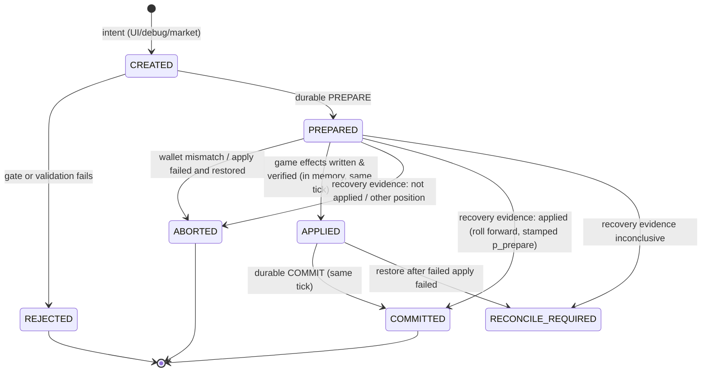
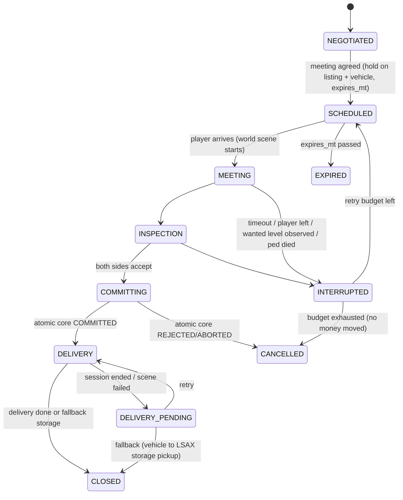

# LSAX — Transaction Core: State Machine, Journal, Idempotency, Recovery

Document: LSAX-TRANSACTION-STATE-MACHINE.md · Spec: LSAX MASTER SPEC v1.0 DRAFT1 · Status: DRAFT for independent audit

Designed **before** any marketplace (invariant 11). The logical commit covers **money + ownership + vehicle
state + market state** (invariant 12). Physical handover is a later world adapter over this core. The protocol
and its recovery rules are VERIFIED (sim) by `phase0-probes/sim/journal_timeline_ref.py` (E8-5) under the
runtime assumptions of B-01.

## 1. Invariants

| ID | Invariant | Enforced by |
|---|---|---|
| TX-I1 | All LSAX-side effects of a transaction commit in one SQLite transaction; all money-coupled game-side effects are applied in the same game tick as that commit | §4 single-tick core |
| TX-I2 | An idempotency key commits at most once on the active timeline path; a replay returns the stored outcome with no effect | `idem_key` check at PREPARE and COMMIT (§5) |
| TX-I3 | No double sale: a vehicle has ≤ 1 live reservation; COMMIT requires the reservation to be held by this txn and the seller to still own the vehicle | reservation table PK(vehicle_id) |
| TX-I4 | No double payment: the wallet is re-read and must equal `cash_before` immediately before apply; roll-forward after a crash only on wallet evidence | §4 step 3, §7 |
| TX-I5 | No ownership transfer without economic commit, and no money movement without ownership commit | both in one COMMIT (TX-I1) |
| TX-I6 | No stale acceptance: offer version, listing version and vehicle state hash checked at PREPARE; expiry checked in MT | §6 |
| TX-I7 | Crash/reload never duplicates: recovery only by evidence (§7); otherwise RECONCILE_REQUIRED | anchor + recovery |
| TX-I8 | While RECONCILE_REQUIRED, every new transaction is refused | gate at PREPARE |
| TX-I9 | Every external world action is bounded by timeout + retry budget + fallback + abort/rollback (invariant 10) | §9 |

## 2. Identifiers

- **TransactionId** — 128-bit random, text form `tx_<26 base32>`. Unique across campaigns.
- **IdempotencyKey** — deterministic from intent: `KIND|actor|subject ids|version` — e.g.
  `LEGAL_BUY|SP1|listing:LS-9F2…|v7`, `ACCEPT_OFFER|SP0|offer:…|v3`, `DEALER_SELL|SP2|veh:…|state:<hash16>`,
  `LISTING_FEE|SP0|listing:…`. The same user intent always yields the same key; a changed version is a new intent.
- **Reservation** — `(vehicle_id | listing_id | offer_id) → txn_id`, unique per subject.

## 3. Transaction kinds (initial set)

| Kind | Money (acting protagonist) | Ownership | Vehicle state | Market state |
|---|---|---|---|---|
| `LEGAL_BUY` | − price − transfer tax | NPC/Dealer → protagonist | registration, LSAX plate, title CLEAN/SALVAGE | listing SOLD, competing offers VOID |
| `ACCEPT_OFFER` (player sells to NPC) | + price − commission | protagonist → NPC | released from binding; lifecycle per delivery | listing SOLD, other offers VOID |
| `DEALER_SELL` (instant) | + dealer acquisition value | protagonist → Dealer | — | any listing WITHDRAWN |
| `LISTING_CREATE` | − listing fee | — | — | listing ACTIVE |
| `LISTING_WITHDRAW` | refund only if system-cancelled | — | — | listing WITHDRAWN |
| `UG_SELL` (fence/chop/export/collector) | + underground value | protagonist → Underground party | lifecycle RETIRED (chop/export) or stays | — ; Heat events |
| `UG_BUY` | − price | Underground → protagonist | title UNDERGROUND | — ; Heat events |
| `TITLE_VERIFY` | − fee | — | title UNKNOWN → CLEAN or STOLEN | — |
| `SERVICE_PAY` (LSAX service/rebuild) | − cost | — | condition/history | — |
| `REFUND` (compensation) | + amount of a named committed txn | reverse of named txn | reverse where defined | reverse where defined |
| `REGISTER_VEHICLE`, `OFFER_CREATE`, `OFFER_COUNTER`, `OFFER_EXPIRE` | none | none / — | registration | offer rows |

Money-neutral kinds cannot use the wallet as recovery evidence; they carry **no game-side effect** by design, so
they are pure DB transactions (crash → either committed or not, no ambiguity).

## 4. Single-tick atomic core (normative, D-TX-1)

All steps run in **one LSAX tick** on the script thread:

1. **Gate:** not RECONCILE_REQUIRED; acting party has a defined wallet (protagonist model); no pending PREPARED txn.
2. **Precommit validation** (§6) against the current projection; idempotency check. Failure → `REJECTED`
   (audit log only, nothing durable in the journal).
3. **PREPARE** (synchronous SQLite commit): txn row `state=PREPARED` with `idem_key`, `kind`, parties, subjects,
   `wallet_before`, `wallet_after`, fees, `p_prepare` (play-time stat), `mt`, `prev_txn` (head of active path),
   planned domain events; reservation rows.
4. **Verify & apply game side:** re-read the acting wallet (`STAT_GET_INT SPx_TOTAL_CASH`); if ≠ `wallet_before`
   → ABORT (another script changed cash in between; R-ECO-1). Else write `wallet_after` (`STAT_SET_INT`), read
   back; mismatch → write `wallet_before` back, read back, ABORT (if the restore also fails → RECONCILE_REQUIRED).
   Apply other in-tick game-side effects (e.g. set plate on an already-bound vehicle). Update the in-memory
   "last known wallet" (D-SL-8).
5. **COMMIT** (synchronous SQLite commit): commit row on the active timeline (`seq`, `p_ms = p_prepare`, `mt`),
   projection updates (ownership, title, vehicle state, listing/offer state, fees ledger, Heat events), txn
   `state=COMMITTED`, reservation rows deleted. Emit mail/notification requests (after commit only).

Cost: 2 fsync'd SQLite commits per transaction tick; budget ≤ 25 ms p95 (R-DB-2; P-DB-01 measures). Transactions
are rare events (player actions, market resolutions), never per frame.

## 5. Idempotency and replay

- PREPARE and COMMIT both reject if a commit with the same `idem_key` exists on the **active path**; the stored
  outcome (txn id, amounts) is returned as `DUPLICATE`.
- A key orphaned by a rewind (its commit lies on an abandoned branch) is **not** on the active path and may commit
  again — the loaded world never saw it (D-TX-3).
- UI double-clicks, repeated key events, message re-delivery and retries after a crash all map to the same key.

## 6. Precommit validation (per kind, all must pass)

Common: acting party wallet defined; `wallet ≥ total debit`; subject rows exist on the active projection; no
reservation held by another txn; identity of any involved world vehicle currently **Bound** with confidence ≥ 85
(never Ambiguous); vehicle lifecycle ∈ {ACTIVE, DORMANT, VIRTUAL} as required; not a mission/script-owned vehicle;
not `GAME_RESPAWN_OF_SOLD` / `CLONE_SUSPECT`.
Legal market: title ∈ {CLEAN, SALVAGE, RECOVERED, LEGACY}; listing `ACTIVE`, `listing.version` = expected;
offer `ACTIVE`, `offer.version` = expected, `offer.expires_mt > MT_now`; buyer budget ≥ price.
Seller side: seller owns the vehicle; vehicle state hash (odometer bucket, condition bucket, mods hash) equals the
hash the offer was made against, else the offer is `STALE` (buyer must re-evaluate).
Underground: access unlocked; Heat rules allow the counterparty (LSAX-HEAT-AND-UNDERGROUND-MODEL.md); daily caps.

## 7. Recovery (at every anchoring)

Resolution of a PREPARED txn after the anchoring of LSAX-SAVELOAD-FEASIBILITY.md §4.3 (position = anchored state):

| Evidence | Verdict |
|---|---|
| anchored state's head == `prev_txn` ∧ P ≥ `p_prepare` ∧ wallet == `wallet_after` ≠ `wallet_before` | **ROLL FORWARD**: COMMIT with `p_ms = p_prepare` (host: ghost/RECOVERY timeline) |
| wallet == `wallet_before`, or anchored state is a different position | **ABORT**, release reservations |
| anything else (e.g. wallet changed by another source during LSAX downtime) | **RECONCILE_REQUIRED(PENDING)** |

Stale cleanup: reservations exist only inside one tick for the core; a reservation found at startup always belongs
to a PREPARED txn and is resolved by the table above. Multi-tick **deal holds** (§8) carry `expires_mt` and
`expires_at_session`; they are released by the market step (every 60 MT min) or at session start.

## 8. Deals: multi-tick orchestration around the core

Physical interactions (meet, inspect, hand over, deliver) are a **Deal** state machine that calls the atomic core
exactly once.

Pre-commit states can always be cancelled without money movement ("rolled back" = never committed). Post-commit
failures never un-commit; they complete through fallback or a `REFUND` compensation transaction with key
`REFUND|<txn_id>` (idempotent).

## 9. External world actions — bounds (normative; AT = active session time)

| Action | Timeout | Retry budget | Fallback | Abort / rollback |
|---|---|---|---|---|
| Model request (`REQUEST_MODEL`/`HAS_MODEL_LOADED`) | 5 s | 3 | — | pre-commit: cancel deal; post-commit: deliver to storage |
| Spawn delivered vehicle | 10 s | 2 | LSAX storage pickup (virtual) | n/a (post-commit) |
| NPC buyer/seller arrival | 180 s | 1 (respawn closer, off-screen) | "no-show" message | cancel deal, release hold |
| Walk-up / greeting task | 30 s | 1 | teleport ped off-screen to mark (not in view) | cancel deal |
| Handover synchronised scene | 30 s | 1 | skip animation, fade | if player > 150 m away or wanted level > 0 observed → cancel (pre-commit) |
| Inspection walkaround | 60 s | 0 | static inspection report | none (informative) |
| Buyer drives away with sold car | 120 s | 0 | despawn when > 200 m and not visible, or at timeout | none (post-commit, entity LSAX-owned) |
| Any LSAX-spawned entity | lifetime ≤ deal lifetime | — | `SET_ENTITY_AS_NO_LONGER_NEEDED` | registry cleanup |

LSAX-spawned entities live in a bounded registry (≤ 16 concurrent peds + vehicles + props). **LSAX never deletes
entities by handle inside `Aborted`** (the handle may belong to the new session, E1-4; the reference mod SellCars does
this, R9). Instead, at the next start, a bounded sweep deletes only entities carrying the current-session ownership
decorator that are not occupied by the player; everything else is released with `SET_ENTITY_AS_NO_LONGER_NEEDED`.
DESIGN DECISION D-WORLD-2.

## 10. Interruption / recovery matrix (appendix, normative)

Crash points: C0 inside PREPARE commit; C1 after PREPARE; C2 after game-side apply, before COMMIT; C3 after COMMIT.

| Interruption | C0 | C1 | C2 | C3 |
|---|---|---|---|---|
| Script exception → SHVDN abort, user reloads scripts (game continues, wallet unchanged by others) | nothing durable; intent lost; UI shows "not completed" | continuation, wallet == before → ABORT | continuation, wallet == after → ROLL FORWARD | consistent; nothing to do |
| As above but another mod changed cash during LSAX downtime | same | wallet ≠ before/after → RECONCILE(PENDING) | RECONCILE(PENDING) | consistent |
| Game crash, then load of latest save (made before the tick) | nothing | not same position or wallet == before → ABORT | save predates apply → ABORT | if save predates commit → rewind: commit orphaned (world lacks it) — consistent |
| In-session load of an older save | nothing | ABORT | ABORT | rewind; orphaned commit; key may be re-used |
| Load of a save written during LSAX downtime after apply (C2) | — | — | ghost slot, wallet == after → ROLL FORWARD on ghost; wallet ambiguous → RECONCILE(TAINTED) | — |
| Save written between PREPARE and apply | impossible (same tick, A-SL-4) | impossible | impossible | — |
| Deal interrupted before COMMITTING | no money moved; deal → INTERRUPTED/CANCELLED | | | |
| Deal interrupted in DELIVERY | money committed; DELIVERY_PENDING → retry → storage fallback | | | |

Every row is exercised by the simulation's crash injection (C0–C3 × SCRIPT_RELOAD / GAME_CRASH / OFFLINE, plus
loads); none produced a safety-invariant failure (E8-5).
